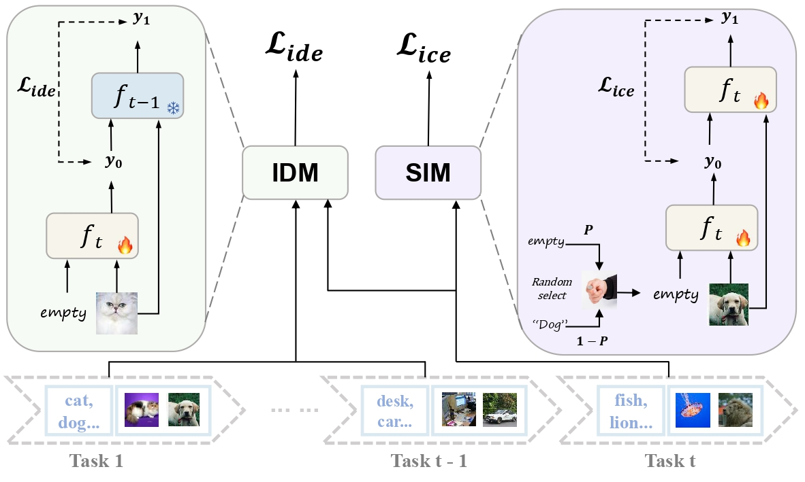

# IDER: Idempotent Experience Replay for Reliable Continual Learning [(ICLR 2026)](https://arxiv.org/abs/2603.00624)

## Abstract

Catastrophic forgetting is a central challenge in continual learning: when a neural network learns new tasks, it often loses performance on previously learned tasks. The IDER paper further points out that continual learning models should not only maintain accuracy, but also produce reliable confidence estimates, especially in mission-critical scenarios.

IDER proposes **Idempotent Experience Replay**, a replay-based continual learning method built on the idempotent property. The method encourages repeated prediction with the model's own output signal to remain stable, and introduces an idempotence distillation objective between the current model and the old checkpoint. As a result, IDER can be integrated with mainstream replay methods and improves prediction reliability while also improving accuracy and reducing forgetting.

In this LibContinual reproduction, ordinary Experience Replay is reported as `baseline`, and IDER corresponds to the paper's `ER+ID`.



## Citation

```bibtex
@article{liu2026ider,
  title={IDER: IDempotent Experience Replay for Reliable Continual Learning},
  author={Liu, Zhanwang and Li, Yuting and Gao, Haoyuan and Li, Yexin and Kong, Linghe and Sun, Lichao and Huang, Weiran},
  journal={arXiv preprint arXiv:2603.00624},
  year={2026}
}
```

## How to Reproduce

The IDER and ER baseline configs are in [config/zz_IDER](../../config/zz_IDER/).

Run one config:

```bash
bash reproduce/ider/scripts/train_one_config.sh ider_cifar100_buf500 0 0
```

Run the 5-seed IDER experiments:

```bash
bash reproduce/ider/scripts/run_cifar10_buf200_5seeds.sh 0 "0 1 2 3 4"
bash reproduce/ider/scripts/run_cifar10_buf500_5seeds.sh 0 "0 1 2 3 4"
bash reproduce/ider/scripts/run_cifar100_buf500_5seeds.sh 0 "0 1 2 3 4"
bash reproduce/ider/scripts/run_cifar100_buf2000_5seeds.sh 0 "0 1 2 3 4"
bash reproduce/ider/scripts/run_tinyimagenet_buf500.sh 0 "0 1 2 3 4"
```

Run the 5-seed ER baseline experiments:

```bash
bash reproduce/ider/scripts/run_er_cifar10_buf200.sh 0 "0 1 2 3 4"
bash reproduce/ider/scripts/run_er_cifar10_buf500.sh 0 "0 1 2 3 4"
bash reproduce/ider/scripts/run_er_cifar100_buf500.sh 0 "0 1 2 3 4"
bash reproduce/ider/scripts/run_er_cifar100_buf2000.sh 0 "0 1 2 3 4"
bash reproduce/ider/scripts/run_er_tinyimagenet_buf500.sh 0 "0 1 2 3 4"
```

Experiment logs and generated summaries are written under the local `output/` directory, which is intentionally excluded from version control.

## Results

The following table compares our LibContinual reproduction with the original paper. `FAA/CIL` is the final class-incremental average accuracy, and `FF` is final forgetting. Higher FAA/CIL is better, lower FF is better.

| Dataset | Buffer | Method | Paper FAA/CIL | Ours FAA/CIL | Paper FF | Ours FF |
|---|---:|---|---:|---:|---:|---:|
| CIFAR-10 | 200 | ER / baseline | 44.46 +/- 2.87 | 48.55 +/- 0.78 | 71.35 +/- 7.77 | 59.84 +/- 1.11 |
| CIFAR-10 | 200 | ER+ID / IDER | 71.02 +/- 1.98 | 70.57 +/- 0.60 | 15.28 +/- 2.41 | 17.06 +/- 1.73 |
| CIFAR-10 | 500 | ER / baseline | 58.84 +/- 3.85 | 61.82 +/- 1.60 | 52.12 +/- 7.56 | 42.84 +/- 2.02 |
| CIFAR-10 | 500 | ER+ID / IDER | 74.74 +/- 0.42 | 75.14 +/- 1.06 | 11.93 +/- 0.49 | 12.28 +/- 0.90 |
| CIFAR-100 | 500 | ER / baseline | 23.41 +/- 1.15 | 20.37 +/- 0.58 | 71.92 +/- 0.74 | 74.23 +/- 0.66 |
| CIFAR-100 | 500 | ER+ID / IDER | 44.82 +/- 0.85 | 44.09 +/- 0.80 | 29.98 +/- 2.52 | 34.86 +/- 1.34 |
| CIFAR-100 | 2000 | ER / baseline | 40.47 +/- 0.95 | 36.53 +/- 0.37 | 51.82 +/- 0.75 | 55.33 +/- 0.47 |
| CIFAR-100 | 2000 | ER+ID / IDER | 56.59 +/- 0.35 | 55.99 +/- 0.39 | 17.46 +/- 1.04 | 20.03 +/- 0.54 |
| TinyImageNet | 500 | ER / baseline | 10.13 +/- 0.39 | 9.252 +/- 0.130 | 74.79 +/- 0.67 | 71.567 +/- 0.140 |
| TinyImageNet | 500 | ER+ID / IDER | 29.88 +/- 1.15 | 30.734 +/- 1.756 | 36.63 +/- 3.37 | 36.682 +/- 4.177 |

For CIFAR experiments, the paper also reports Expected Calibration Error (ECE). Lower ECE is better.

| Dataset | Buffer | Method | Paper ECE | Ours ECE |
|---|---:|---|---:|---:|
| CIFAR-10 | 200 | ER / baseline | 45.53 | 45.57 +/- 0.78 |
| CIFAR-10 | 200 | ER+ID / IDER | 12.36 | 12.96 +/- 0.82 |
| CIFAR-10 | 500 | ER / baseline | 32.69 | 32.61 +/- 1.57 |
| CIFAR-10 | 500 | ER+ID / IDER | 11.73 | 12.33 +/- 0.84 |
| CIFAR-100 | 500 | ER / baseline | 64.59 | 65.53 +/- 0.58 |
| CIFAR-100 | 500 | ER+ID / IDER | 13.65 | 10.94 +/- 1.03 |
| CIFAR-100 | 2000 | ER / baseline | 45.64 | 48.58 +/- 0.30 |
| CIFAR-100 | 2000 | ER+ID / IDER | 12.87 | 10.61 +/- 0.63 |

Overall, the reproduced IDER results are close to the original paper across CIFAR-10, CIFAR-100, and TinyImageNet. The reproduced experiments preserve the main conclusions of the paper: IDER improves final class-incremental accuracy, reduces forgetting, and substantially improves calibration on CIFAR settings.
